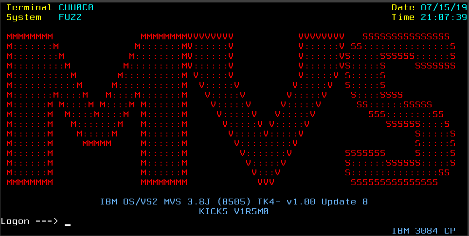
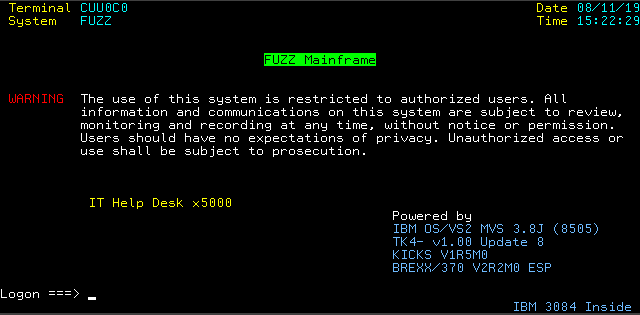
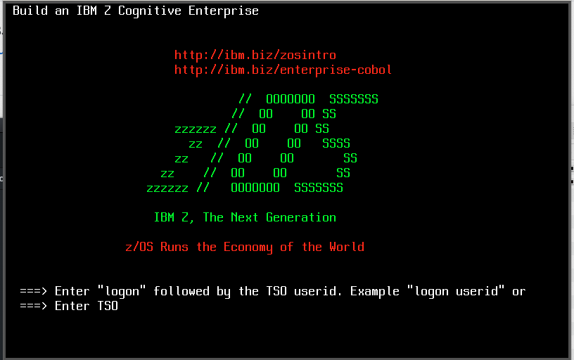

# mainframe-misc
While making the journey into the wonderful world of the mainframe, I've started writing some small bits of code, usally consisting of one or 2 files (datasets).  Given the simplicity and size of each, I do not feel like they warrant a seperate github repo.  This repo is my collection of random small bits of useful things for mainframes, [MVS 3.8J/TK4-](http://wotho.ethz.ch/tk4-/) primarily.

|  DIR/FILE             | Description           | 
|-----------------------|-|
|**NETSOL.CNTL**        | Series of NETSOL Logon Screens for MVS 3.8J / TK4-.|
|**NETSOL.CNTL/MVSLOGO**| Logon Screen with MVS in large friendly letters. |
|**NETSOL.CNTL/FUZZCOLR**| Logon Screen with site specific details and a warning/disclaimer. |
|**NETSOL.CNTL/ZOSCBL**| Logon that was mean to reproduce the one used for z/OS with the Open Mainframe Project COBOL Course. |
|**SYS2.EXEC**          | A collection of REXX scripts written for [BREXX/370](https://github.com/mgrossmann/brexx370). As far as I am aware, this is the only version of REXX that is freely available for TK4-.|
|**images/**            |This just has screenshots used in this file.|


## Note about NETSOL logon screens
After 'SUBMIT' of the logon screen, you will either need to shutdown and IPL, or restart several services to make the new screen active.
### Steps to stop and restart services after replacing logon screen
From Hercules console (if you are not running in automated mode) or the Hercules Web console, enter the following 3 commands to stop the related services:
```
/Z NET,QUICK
/P SNASOL
/P JRP
```
Wait about a minute (on a slow system), then restart these as follows:
```
/S NET
/S SNASOL
/S JRP
```